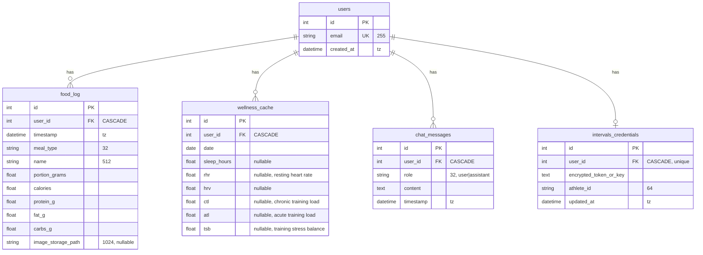

# Схема базы данных Smart Trainer

## Диаграмма связей (ER)

## Таблицы и поля

### 1. `users` — пользователи

| Колонка     | Тип              | Ограничения        | Описание              |
|-------------|------------------|--------------------|------------------------|
| id          | INTEGER          | PK, autoincrement  | Идентификатор          |
| email       | VARCHAR(255)     | NOT NULL, UNIQUE   | Email (логин)          |
| created_at  | TIMESTAMP (tz)   | —                  | Дата регистрации       |

**Индексы:** `ix_users_email` (unique) на `email`.

---

### 2. `food_log` — журнал питания

| Колонка            | Тип              | Ограничения   | Описание                    |
|--------------------|------------------|---------------|-----------------------------|
| id                 | INTEGER          | PK            | Идентификатор               |
| user_id            | INTEGER          | FK → users.id, CASCADE | Владелец записи      |
| timestamp          | TIMESTAMP (tz)   | —             | Время приёма пищи           |
| meal_type          | VARCHAR(32)     | —             | Тип приёма: breakfast, lunch, dinner, snack, other |
| name               | VARCHAR(512)    | NOT NULL      | Название блюда/продукта     |
| portion_grams      | FLOAT            | NOT NULL      | Порция, граммы              |
| calories           | FLOAT            | NOT NULL      | Калории                     |
| protein_g          | FLOAT            | NOT NULL      | Белки, г                    |
| fat_g             | FLOAT            | NOT NULL      | Жиры, г                     |
| carbs_g           | FLOAT            | NOT NULL      | Углеводы, г                 |
| image_storage_path | VARCHAR(1024)   | nullable      | Путь к фото порции          |

**Связь:** многие записи на одного пользователя (1:N).  
**Индексы:** `ix_food_log_user_id` на `user_id`.

---

### 3. `wellness_cache` — кэш показателей самочувствия

| Колонка   | Тип            | Ограничения   | Описание                    |
|-----------|----------------|---------------|-----------------------------|
| id        | INTEGER        | PK            | Идентификатор               |
| user_id   | INTEGER        | FK → users.id, CASCADE | Владелец              |
| date      | DATE           | NOT NULL      | Дата дня                    |
| sleep_hours | FLOAT        | nullable      | Часы сна                    |
| rhr       | FLOAT          | nullable      | Resting heart rate (пульс покоя) |
| hrv       | FLOAT          | nullable      | Heart rate variability      |
| ctl       | FLOAT          | nullable      | Chronic training load       |
| atl       | FLOAT          | nullable      | Acute training load         |
| tsb       | FLOAT          | nullable      | Training stress balance     |

**Связь:** много записей на одного пользователя (1:N).  
**Индексы:** `ix_wellness_cache_user_id`, `ix_wellness_cache_date`.

---

### 4. `chat_messages` — сообщения чата с ассистентом

| Колонка   | Тип              | Ограничения   | Описание           |
|-----------|------------------|---------------|--------------------|
| id        | INTEGER          | PK            | Идентификатор      |
| user_id   | INTEGER          | FK → users.id, CASCADE | Владелец   |
| role      | VARCHAR(32)      | NOT NULL      | user \| assistant  |
| content   | TEXT             | NOT NULL      | Текст сообщения    |
| timestamp | TIMESTAMP (tz)   | —             | Время сообщения    |

**Связь:** много сообщений на одного пользователя (1:N).  
**Индексы:** `ix_chat_messages_user_id`.

---

### 5. `intervals_credentials` — учётные данные Intervals.icu

| Колонка               | Тип              | Ограничения           | Описание                |
|-----------------------|------------------|------------------------|-------------------------|
| id                    | INTEGER          | PK                     | Идентификатор           |
| user_id               | INTEGER          | FK → users.id, CASCADE, UNIQUE | Один пользователь — одна запись |
| encrypted_token_or_key | TEXT            | NOT NULL               | Зашифрованный токен/ключ |
| athlete_id            | VARCHAR(64)      | NOT NULL               | ID атлета в Intervals   |
| updated_at            | TIMESTAMP (tz)   | —                      | Время обновления        |

**Связь:** одна запись на пользователя (1:1).  
**Индексы:** `ix_intervals_credentials_user_id` (unique) на `user_id`.

---

## Сводка связей

| Таблица                 | Связь с `users` | При удалении user |
|-------------------------|-----------------|-------------------|
| food_log                | N → 1           | CASCADE           |
| wellness_cache          | N → 1           | CASCADE           |
| chat_messages           | N → 1           | CASCADE           |
| intervals_credentials   | 1 → 1           | CASCADE           |

*Схема соответствует миграции `backend/alembic/versions/001_initial.py` и моделям в `backend/app/models/`.*
